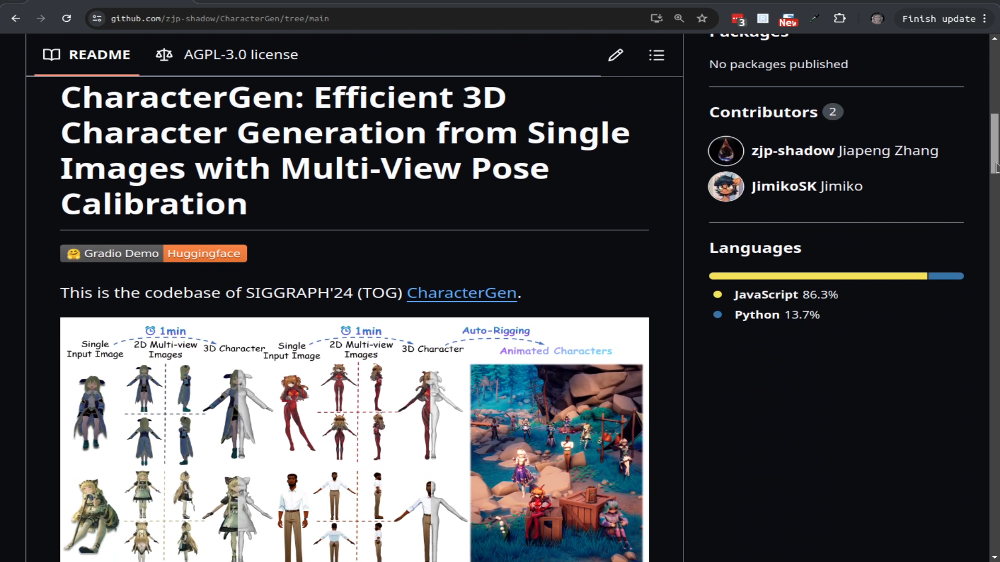
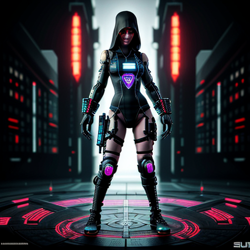
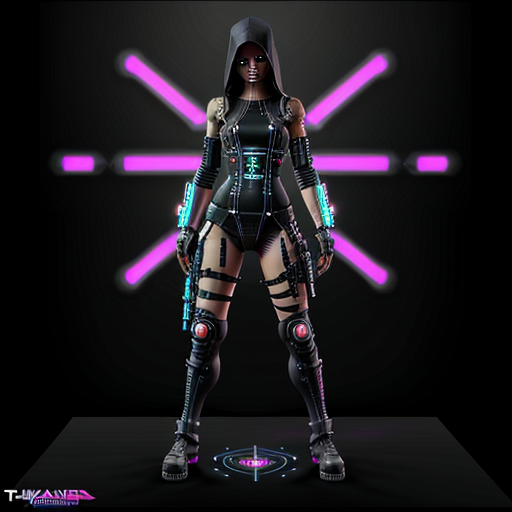
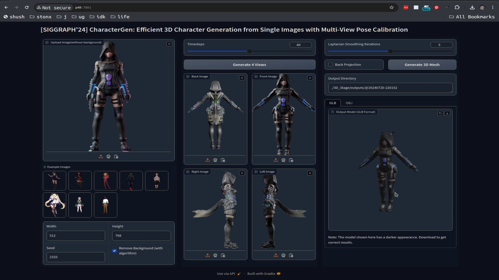
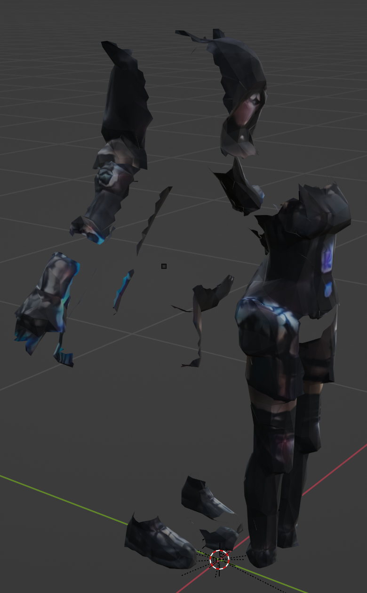
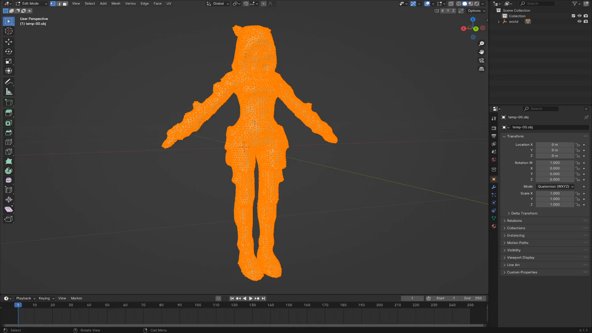
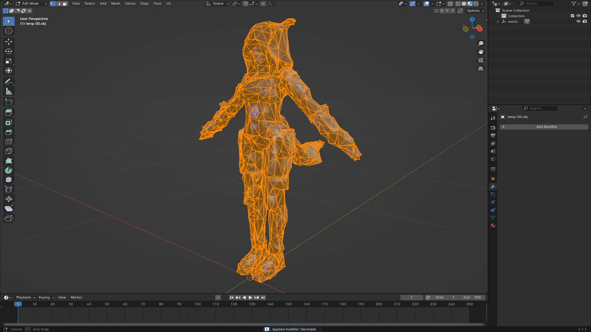
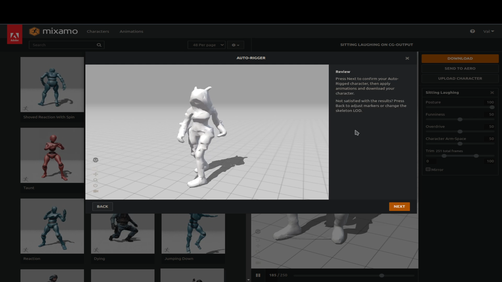
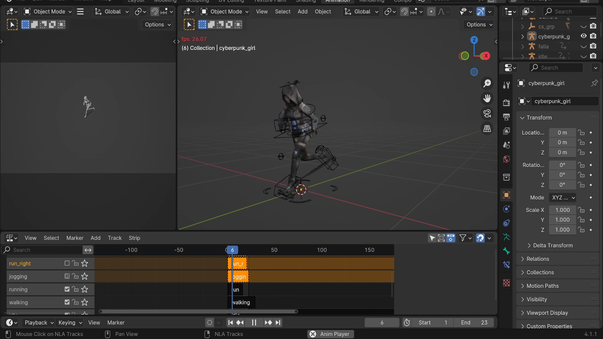
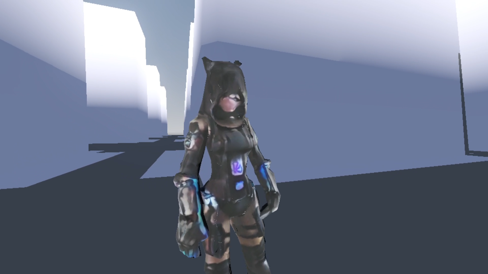

# Cyberpunk Assassin Girl Project: AI Character Generation Workflow

## Introduction

[Page](http://www.loose-bit-labs.com/cyberpunk-girl-character-gen-demo/)
[GitHub](https://github.com/loose-bit-labs/cyberpunk-girl-character-gen-demo/)
[Live Demo](https://www.loose-bit-labs.com/cyberpunk-girl-character-gen-demo/godot/CybergirlCharacterGenDemo.html)

Inspired by a project that came across Reddit that generates 3D characters from example images. Let's embark on an exciting journey of creating a cyberpunk assassin girl character using Stable Diffusion for model generation, followed by animation via Mixamo and integration into the Godot game engine. The final result showcases impressive potential even though it's currently at a slightly lower resolution.

<a href="https://github.com/zjp-shadow/CharacterGen/"></a>

Please see [credits](CREDITS.md) for details.

### Overview 

1. Initial character from stable diffusion [text-to-image](stable-diffusion/step1)
2. Refine the pose uing [image-to-image](stable-diffusion/step2)
3. Generate the 3D Model using [CharacterGen](https://github.com/zjp-shadow/CharacterGen/)
4. Cleanup in Blender and export as FBX
5. Animate with Mixamo
6. Combined the animations in Blender and export as GLB
7. Create [Godot Demo](godot/CybergirlCharacterGenDemo.html)

## Step-by-Step Process

### 1. Initial Image Generation with Stable Diffusion

Imagine an example image of a character, and create a stable diffusion prompt for 3D model generation.

```Stable Diffusion Prompt: "Full front view  view of a cyberpunk assassin girl in a ((t-pose)) on a (solid black  background), full body"```



### 2. Refine Initial Image with Stable Diffusion

Iterate through rerolls to achieve a suitable starting pose for the generated character model using Stable Diffusion or an alternate technique if needed.



### 3. Generate the 3D Model using CharacterGen

The character generation itself was super fast and it looks pretty good.


### 4. Cleanup and FBX Export

- Decimate the high-poly count model in Blender for better performance during animation exporting while maintaining an appealing look.
- Refine the character focusing on removing unwanted elements such as the tail.




Another quirk to the model is that it is in multiple sections! Happily this didn't impact the downstream activities


### 5. Animate the Character with Mixamo



### 6. Combine the Animations in Blender into NLA strips and re-export to GBL



### 7. Godot demo of the character.



## Results & Future Improvements

The final character generation and animation process resulted in an impressive cyberpunk assassin girl model, despite the initial lower resolution. The project holds great promise for future iterations with higher-resolution models and more refined animations.

The [CharacterGen](https://github.com/zjp-shadow/CharacterGen/) project has a lot more to it than explored here. It's also interesting to imagine more fully automated workflows.

Bonus [timeline-for-shotcut.py](bin/timeline-for-shotcut.py) can be used to export timeline for clips in playlists in Shotcut MLT files.
